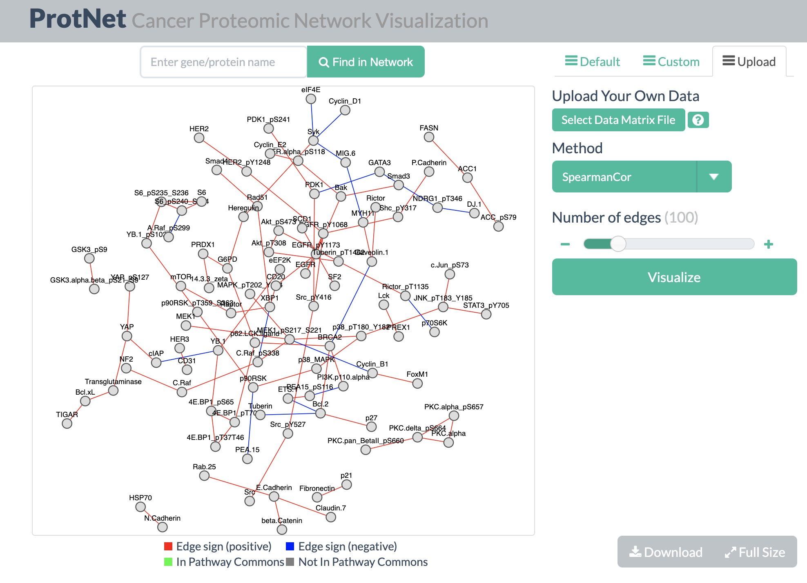

# ProtNet
- Perform protein network inference from RPPA data with 13 methods. 
- [Web application](http://projects.sanderlab.org/protnet/) allows cancer proteomic network visualization with public and user-owned datasets.

# Methods
- Methods that do not require parameter optimization are GeneNet (shrunken covariance matrix), Simple Partial Correlation (regular covariance matrix), Spearman Correlation and Pearson Correlation.
- Method that require parameter optimization are Graphical LASSO, RidgeNet, LassoNet, PLSNet, ElasticNet, and mutual information-based method CLR, MRNET, ARACNE (additive and multiplicative variants).
- Parameter optimization is performed by maximizing the area under the precision-recall curve (AUPR). This is performed by the longPrecisionRecall function. For zero-weight edges, order is assigned randomly.

# Ground truth for protein-protein interactions
- The ground truth for computing precision & recall values is the PERA output from Pathway Commons. The input to PERA is the set of 187 antibodies used in the TCGA PANCAN11 collection. 51 of these were phosphospecific and 136 were non-phosphospecific. Please see [Senbabaoglu et al (PLOS Comp Bio, 2016)](https://journals.plos.org/ploscompbiol/article?id=10.1371/journal.pcbi.1004765) for more information.
- PERA output can be found in this repository under protnet/DATA/PERA

# Scripts
1) run_methods.r 
- Run all 13 methods with the appropriate arguments

2) choose_best_parameter.r 
- Determine optimal parameter values and resulting edge predictions for methods that require parameter optimization
